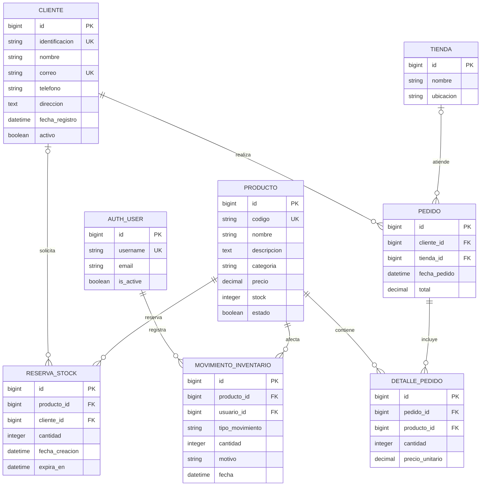

# Modelo Entidad-Relación de la Base de Datos

Este diagrama representa el modelo persistente definido por Django en `backend/api/models.py` y sus migraciones. Incluye las entidades propias del dominio y la relación con el usuario nativo de Django utilizado para autenticar y auditar movimientos de inventario.

## Diagrama ER

## Interpretación de las relaciones

- Un `CLIENTE` puede realizar muchos `PEDIDO`; cada pedido pertenece obligatoriamente a un cliente.
- Una `TIENDA` puede atender muchos pedidos; la tienda de un pedido es opcional y puede quedar en `NULL` si se elimina la tienda.
- Un `PEDIDO` puede contener cero o muchos `DETALLE_PEDIDO` a nivel de base de datos; el flujo normal de creación de ventas agrega uno o más. Cada detalle registra la cantidad y el precio unitario aplicado en ese momento.
- Un `PRODUCTO` puede aparecer en muchos detalles de pedido, reservas y movimientos de inventario.
- Una `RESERVA_STOCK` pertenece a un producto y puede asociarse opcionalmente con un cliente.
- Un `MOVIMIENTO_INVENTARIO` registra una entrada o salida de un producto. Puede asociarse opcionalmente con un usuario; si el usuario se elimina, el movimiento se conserva y su usuario queda en `NULL`.
- La relación entre `PEDIDO` y `PRODUCTO` es de muchos a muchos conceptualmente, resuelta mediante `DETALLE_PEDIDO`.

## Reglas de integridad relevantes

- `Cliente.identificacion`, `Cliente.correo` y `Producto.codigo` son únicos.
- Al guardar un producto, si `stock` llega a cero, Django establece `estado=False`; si vuelve a tener stock, establece `estado=True`.
- Los movimientos de inventario se eliminan si se elimina el producto (`CASCADE`).
- Los detalles de un pedido se eliminan junto con el pedido (`CASCADE`).
- Un producto no se puede eliminar mientras existan detalles asociados (`PROTECT`).
- Una tienda eliminada no borra los pedidos existentes; su referencia queda nula (`SET_NULL`).
- Un usuario eliminado no borra los movimientos auditados; su referencia queda nula (`SET_NULL`).

## Flujo de datos de una venta

1. Se crea un `PEDIDO` asociado a un cliente y, opcionalmente, a una tienda.
2. Se crean uno o más `DETALLE_PEDIDO` con producto, cantidad y precio unitario.
3. Se descuenta `PRODUCTO.stock` y se recalcula su estado.
4. Se registra un `MOVIMIENTO_INVENTARIO` de tipo `SALIDA` por cada producto.
5. Se calcula y guarda el total del pedido.

Este flujo se implementa en `PedidoSerializer.create()` dentro de `backend/api/serializers.py` y se ejecuta dentro de una transacción atómica.
